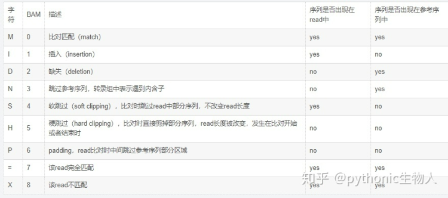

# 核心思想
+ 按行读取sam文件的每一行内容,先读取header section部分的@SQ,可以得到所有染色体和没条染色体的位点总数,提前构建好map
+ 然后多线程读取alignment section部分的内容,每个线程读取一部分内容,在读取第一条read时需要记录并去重
+ 然后根据遍历该read上的每个碱基,每个碱基在染色体上的读取位点就等于该read的第四列也就是对比到参考序列的位置+碱基的下标. 
+ 同时可以根据flag值来对整条read进行一些过滤,比如BAM_FUNMAP, BAM_FSECONDARY, BAM_FQCFAIL, BAM_FDUP 分别表示(序列没有mapping到参考序列上,序列不是主要的比对,序列在QC时失败了，被过滤掉了,序列是PCR重复序列).
+ 根据cigar值判断每个该read上每个碱基是否计入统计

比如3M1D2M1I1M3M表示3个碱基匹配,全部计入统计,1D表示read上碱基缺失,直接跳过,2M表示2个碱基完全匹配,全部计入统计,1I表示一个碱基插入,直接跳过,1M表示1个碱基匹配,计入统计
+ 读取完每条read上的每个碱基后,就可以统计出该条染色体的每个位点的测序深度